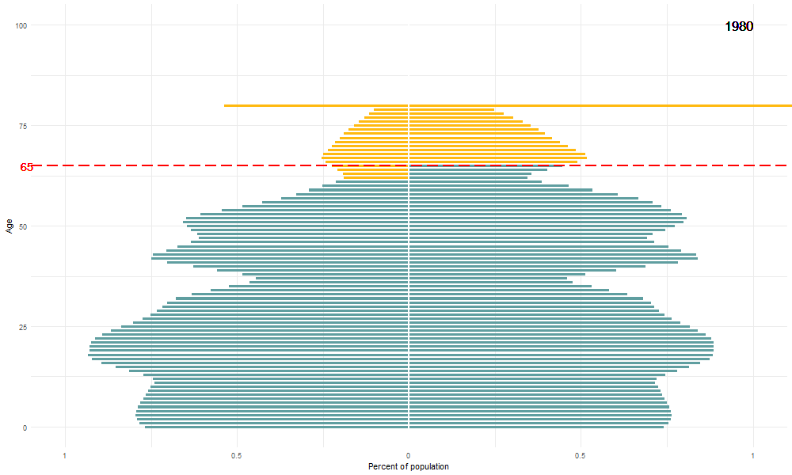
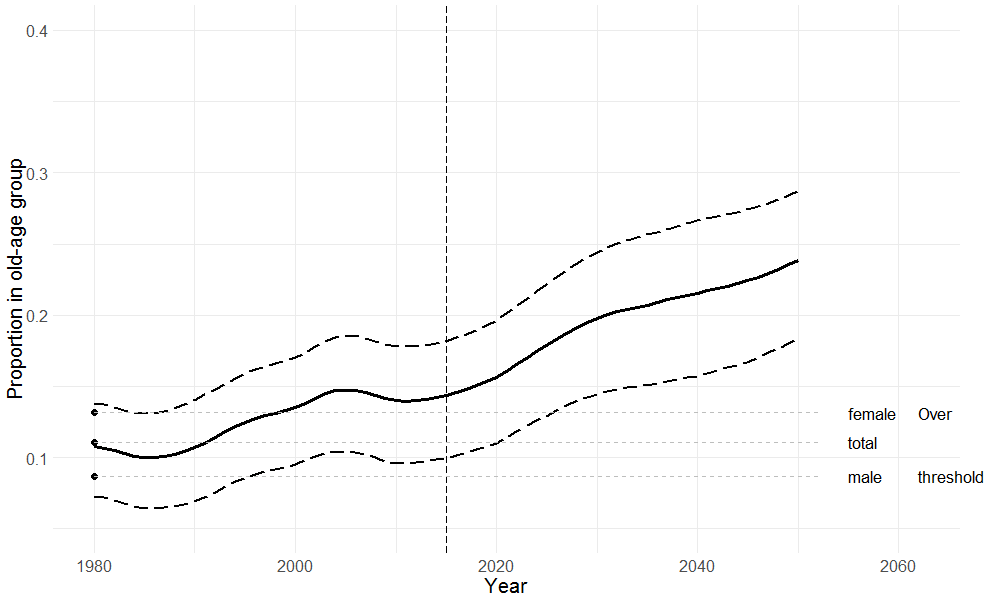
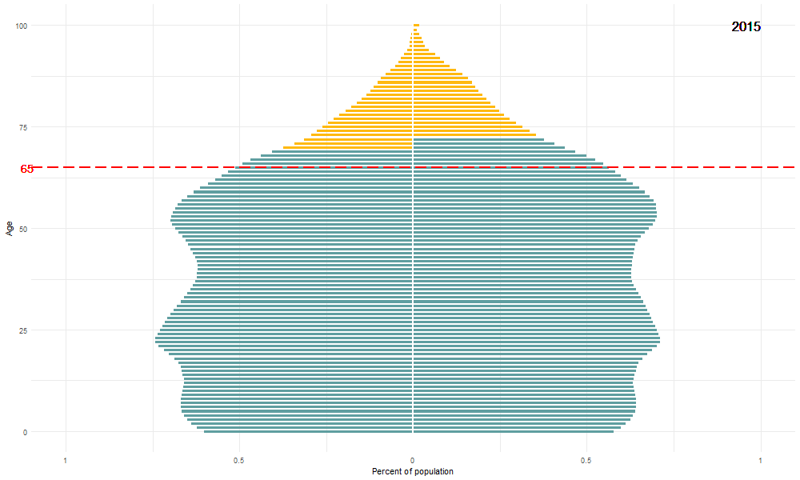

# Outline


--
1. What is population ageing?


--
2. What is *prospective age*?


--
3. Bring it home


---

# Measuring Ageing

--

* Individual level:

--

    + Age
--

    + ...
--

* Population level:

--

    + proportion over age e.g. 65
--

    + old-age dependency ratio et al.
--

    + median age
  
???
On the individual level we usually speak of ageing chronologically, you grow one year older every year. Of course there are other ways of looking at age here, how old you look or how old you feel..

On the Populaiton level there are a few standard measures. 

One thing to note is that individual level ageing only goes one way, but populaiton level ageing can go both ways. 


---

# Retrospective vs Prospective Age


So, what is wrong with using *chronological age* to measure ageing?
--
<br>
<br>

.bold[.center[60-year old in 1800 = 60-year old 2000 ?]]
--
<br>

> "*In contrast to the growth of interest in and concern about population ageing, the concepts used in analyzing it have remained static.*" 

.right[Sanderson & Scherbov 2008]
 
<br>
<br>
--

What else has grown?  
--
<span style="color:red">Life expectancy!</span>

???

It assumes that a 60 year old person in 1800 is just as old as a 60-year old person in 2000, just because they have lived the same number of years. But have they aged at the same rate? 
Well, in 1800 only 25% of men survived to the age of 60, while today that number is over 90 %. So clearly the answer is no, thewe two 60 year-olds are not the same at all. One is middle aged and one is elderly. 

At this point I will skip the standard thing that everyone does when they present here, so I won't actually talk directly about the increases in life expectancy and assume you know it's pretty much going up just about everyhwere. 

But this is the point: chronological age does not take into account changes in life excpectancy. 
---

# Prospective age

```{r, echo = FALSE, fig.height=4, dev='svg'}
par(mar = c(0,1.5,0,0))
plot(1, xlim = c(0,100),
     ylim = c(0,7), type = "n", 
     axes = FALSE, bty = "n",
     xlab = "", ylab = "")

text(-5, 5.5, "1952", xpd = TRUE)
rect(10,5, 40, 6, col = "cornsilk3")
text(25, 5.5, "30 years lived")
rect(40,5, 84.7, 6, col = "darkgoldenrod2")
text(60, 5.5, "remaining life expectancy: 44.7")

```

---

# Prospective age

```{r, echo = FALSE, fig.height=4, dev='svg'}
par(mar = c(0,1.5,0,0))
plot(1, xlim = c(0,100),
     ylim = c(0,7), type = "n", 
     axes = FALSE, bty = "n",
     xlab = "", ylab = "")

text(-5, 5.5, "1952", xpd = TRUE)
rect(10,5, 40, 6, col = "cornsilk3")
text(25, 5.5, "30 years lived")
rect(40,5, 84.7, 6, col = "darkgoldenrod2")
text(60, 5.5, "remaining life expectancy: 44.7")
text(-5, 4.5, "2005", xpd = TRUE)
rect(10,4, 40, 5, col = "cornsilk3")
text(25, 4.5, "30 years lived")
rect(40,4, 94.4, 5, col = "darkgoldenrod2")
text(60, 4.5, "remaining life expectancy: 54.4")

```

---

# Prospective age

```{r, echo = FALSE, fig.height=4, dev='svg'}
par(mar = c(0,1.5,0,0))
plot(1, xlim = c(0,100),
     ylim = c(0,7), type = "n", 
     axes = FALSE, bty = "n",
     xlab = "", ylab = "")

text(-5, 5.5, "1952", xpd = TRUE)
rect(10,5, 40, 6, col = "cornsilk3")
text(25, 5.5, "30 years lived")
rect(40,5, 84.7, 6, col = "darkgoldenrod2")
text(60, 5.5, "remaining life expectancy: 44.7")
text(-5, 4.5, "2005", xpd = TRUE)
rect(10,4, 40, 5, col = "cornsilk3")
text(25, 4.5, "30 years lived")
rect(40,4, 94.4, 5, col = "darkgoldenrod2")
text(60, 4.5, "remaining life expectancy: 54.4")

arrows(10, 3.8, 40, 3.8, length = .15, lwd = 3, col = "red")
```

---

# Prospective age

```{r, echo = FALSE, fig.height=4, dev='svg'}
par(mar = c(0,1.5,0,0))
plot(1, xlim = c(0,100),
     ylim = c(0,7), type = "n", 
     axes = FALSE, bty = "n",
     xlab = "", ylab = "")

text(-5, 5.5, "1952", xpd = TRUE)
rect(10,5, 40, 6, col = "cornsilk3")
text(25, 5.5, "30 years lived")
rect(40,5, 84.7, 6, col = "darkgoldenrod2")
text(60, 5.5, "remaining life expectancy: 44.7")
text(-5, 4.5, "2005", xpd = TRUE)
rect(10,4, 40, 5, col = "cornsilk3")
text(25, 4.5, "30 years lived")
rect(40,4, 94.4, 5, col = "darkgoldenrod2")
text(60, 4.5, "remaining life expectancy: 54.4")

arrows(10, 3.8, 40, 3.8, length = .15, lwd = 3, col = "red")

text(-5, 2.5, "1952", xpd = TRUE)
rect(10,2, 40, 3, col = "cornsilk3")
text(25, 2.5, "30 years lived")
rect(40,2, 84.7, 3, col = "darkgoldenrod2")
text(60, 2.5, "remaining life expectancy: 44.7")

```

---

# Prospective age

```{r, echo = FALSE, fig.height=4, dev='svg'}
par(mar = c(0,1.5,0,0))
plot(1, xlim = c(0,100),
     ylim = c(0,7), type = "n", 
     axes = FALSE, bty = "n",
     xlab = "", ylab = "")

text(-5, 5.5, "1952", xpd = TRUE)
rect(10,5, 40, 6, col = "cornsilk3")
text(25, 5.5, "30 years lived")
rect(40,5, 84.7, 6, col = "darkgoldenrod2")
text(60, 5.5, "remaining life expectancy: 44.7")
text(-5, 4.5, "2005", xpd = TRUE)
rect(10,4, 40, 5, col = "cornsilk3")
text(25, 4.5, "30 years lived")
rect(40,4, 94.4, 5, col = "darkgoldenrod2")
text(60, 4.5, "remaining life expectancy: 54.4")

arrows(10, 3.8, 40, 3.8, length = .15, lwd = 3, col = "red")

text(-5, 2.5, "1952", xpd = TRUE)
rect(10,2, 40, 3, col = "cornsilk3")
text(25, 2.5, "30 years lived")
rect(40,2, 84.7, 3, col = "darkgoldenrod2")
text(60, 2.5, "remaining life expectancy: 44.7")

text(-5, 1.5, "2005", xpd = TRUE)
rect(40,1, 84.7, 2, col = "darkgoldenrod2")
text(60, 1.5, "remaining life expectancy: 44.7")
rect(0, 1, 40, 2, col = "cornsilk3")
text(20, 1.5, "40 years lived")

```
---

# Prospective age

```{r, echo = FALSE, fig.height=4, dev='svg'}
par(mar = c(0,1.5,0,0))
plot(1, xlim = c(0,100),
     ylim = c(0,7), type = "n", 
     axes = FALSE, bty = "n",
     xlab = "", ylab = "")

text(-5, 5.5, "1952", xpd = TRUE)
rect(10,5, 40, 6, col = "cornsilk3")
text(25, 5.5, "30 years lived")
rect(40,5, 84.7, 6, col = "darkgoldenrod2")
text(60, 5.5, "remaining life expectancy: 44.7")
text(-5, 4.5, "2005", xpd = TRUE)
rect(10,4, 40, 5, col = "cornsilk3")
text(25, 4.5, "30 years lived")
rect(40,4, 94.4, 5, col = "darkgoldenrod2")
text(60, 4.5, "remaining life expectancy: 54.4")

arrows(10, 3.8, 40, 3.8, length = .15, lwd = 3, col = "red")

text(-5, 2.5, "1952", xpd = TRUE)
rect(10,2, 40, 3, col = "cornsilk3")
text(25, 2.5, "30 years lived")
rect(40,2, 84.7, 3, col = "darkgoldenrod2")
text(60, 2.5, "remaining life expectancy: 44.7")

text(-5, 1.5, "2005", xpd = TRUE)
rect(40,1, 84.7, 2, col = "darkgoldenrod2")
text(60, 1.5, "remaining life expectancy: 44.7")
rect(0, 1, 40, 2, col = "cornsilk3")
text(20, 1.5, "40 years lived")

arrows(84.7, 0.8, 40, 0.8, length = .15, lwd = 3, col = "red")
```


---
# Inflation

 | 1952          | 2005
------------- | -------------|------------------
US GDP - current dollars (billions)  |    415  |   12,421
US GDP - 2000 dollars (billions) |     2,213  |   10,989
US median age - current chronological age  |    30.2 |   36.1
US median age - prospective age based on 2000 life table |     36.3 |   35.5

???

So ignoring inflation US GDP went from 400 billion to 12 trillion. But taking inflation into account the increase is much lower. 

Similarly if we look at chronological age the median age - the age where half the US population is under and half over that age -- has gone up from 30.2 to 36.1, almost six years. But if we use prospective age based on teh 2000 life table, then the prospective median age has actually declined a little bit. This means that people at the mediana age in 2005 had a longer remaining life expectancy than people at the median age in 1952. SO the 36.1 year old has longer to live than the 30.2 year old did in 1952, that's why their prospective age is lower. 

---
# Defining old age

--

* fixed age threshold: 

    + UK - Friendly Societies Act (1875): "any age after 50"

    + Bismarck (1899) *Old Age Insurance Law* for which workers were eligible at age 71

    + American Social Security Act of 1935: age 65

--

* remaining life expectancy threshold:

    + Ryder (1975): *index of old age* 10 years left

    + Siegel (1993): 10 or 15 years left
    
    + Sanderson and Scherbov (2008): 15 years left - $RLE_{15}$ 
    
    
???
Not necessarily the best way: we could look at a host of physical, environmental, psychological and other factors, but we just don't have enough informaiton to do sth like this. This has the advantage of simplicity and data availability
---

# Prospective ageing in specially selected countries 1980-2050

* Old age threshold: 15 years remaining life expectancy - $RLE_{15}$

--

* Population pyramid with $RLE_{15}$

--

* Proportion of the population over 65 vs proportion over $RLE_{15}$


---

### Korea: Old-age threshold

```{r echo = FALSE}

```

---

### Korea: Population pyramid

```{r echo = FALSE}
knitr::include_graphics("figures/pyramid_65_Republic_of_Korea_1980-2015.gif")
```
---

### Korea: Population pyramid

```{r echo = FALSE}
knitr::include_graphics("figures/pyramid_65_Republic_of_Korea_2015-2050.gif")
```

---

### Korea: Proportion "old"

```{r echo = FALSE}

```

---

### Korea: Proportion "old"

```{r echo = FALSE}

```


---


### Georgia: Old-age threshold

```{r echo = FALSE}

```

---

### Georgia: Population pyramid

```{r echo = FALSE}

```
---

### Georgia: Population pyramid

```{r echo = FALSE}

```

---

### Georgia: Proportion "old"

```{r echo = FALSE}

```

---

### Georgia: Proportion "old"

```{r echo = FALSE}

```

### China: Old-age threshold

```{r echo = FALSE}

```

---

### China: Population pyramid

```{r echo = FALSE}

```
---

### China: Population pyramid

```{r echo = FALSE}

```

---

### China: Proportion "old"

```{r echo = FALSE}

```

---

### China: Proportion "old"

```{r echo = FALSE}

```


---

### Italy: Old-age threshold

```{r echo = FALSE}
knitr::include_graphics("figures/Italy.gif")
```

---

### Italy: Population pyramid

```{r echo = FALSE}

```
---

### Italy: Population pyramid

```{r echo = FALSE}

```

---

### Italy: Proportion "old"

```{r echo = FALSE}

```

---

### Italy: Proportion "old"

```{r echo = FALSE}

```

---

### Belarus: Old-age threshold

```{r echo = FALSE}

```

---

### Belarus: Population pyramid

```{r echo = FALSE}

```
---

### Belarus: Population pyramid

```{r echo = FALSE}

```

---

### Belarus: Proportion "old"

```{r echo = FALSE}

```

---

### Belarus: Proportion "old"

```{r echo = FALSE}

```

---

### Japan: Old-age threshold

```{r echo = FALSE}

```

---

### Japan: Population pyramid

```{r echo = FALSE}

```
---

### Japan: Population pyramid

```{r echo = FALSE}
knitr::include_graphics("figures/pyramid_65_Japan_2015-2050.gif")
```

---

### Japan: Proportion "old"

```{r echo = FALSE}

```

---

### Japan: Proportion "old"

```{r echo = FALSE}

```


---

###  United States of America: Old-age threshold

```{r echo = FALSE}

```

---

###  United States of America: Population pyramid

```{r echo = FALSE}

```
---

###  United States of America: Population pyramid

```{r echo = FALSE}

```

---

###  United States of America: Proportion "old"

```{r echo = FALSE}

```

---

###  United States of America: Proportion "old"

```{r echo = FALSE}

```


---

### Spain: Old-age threshold

```{r echo = FALSE}
knitr::include_graphics("figures/Spain.gif")
```

---

### Spain: Population pyramid

```{r echo = FALSE}

```
---

### Spain: Population pyramid

```{r echo = FALSE}
knitr::include_graphics("figures/pyramid_65_Spain_2015-2050.gif")
```

---

### Spain: Proportion "old"

```{r echo = FALSE}

```

---

### Spain: Proportion "old"

```{r echo = FALSE}

```


---
### United Kingdom: Old-age threshold

```{r echo = FALSE}
knitr::include_graphics("figures/United_Kingdom.gif")
```

---

### United Kingdom: Population pyramid

```{r echo = FALSE}

```
---

### United Kingdom: Population pyramid

```{r echo = FALSE}

```

---

### United Kingdom: Proportion "old"

```{r echo = FALSE}

```
---

### United Kingdom: Proportion "old"

```{r echo = FALSE}

```


---

# Rankings - Proportion over 65
```{r, echo = FALSE}
final <- readRDS("final.rds")
knitr::kable(final[,c(1,2,5,6)], format = 'html', digits = 2,
             col.names = c("2018", "prop > 65",
                           "2050", "prop > 65"),
             row.names = TRUE)
```

---

# Rankings - Proportion over RLE_15 

```{r, echo = FALSE}
final <- readRDS("final.rds")
knitr::kable(final[,c(3,4,7,8)], format = 'html', digits = 2,
             col.names = c("2018", "prop > RLE_15",
                           "2050", "prop > RLE_15"),
             row.names = TRUE)
```